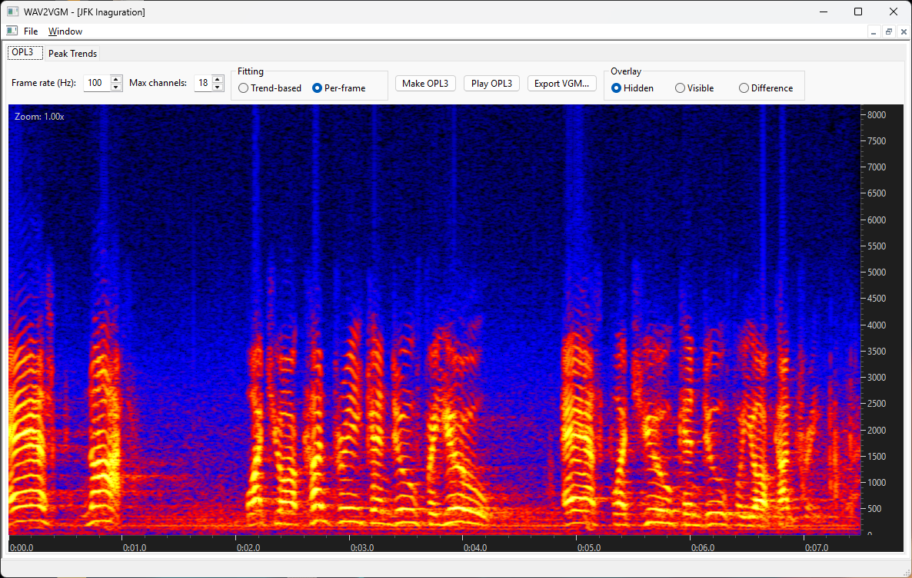
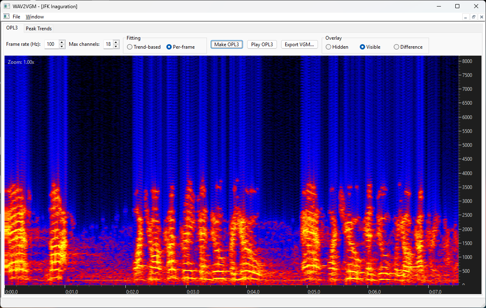
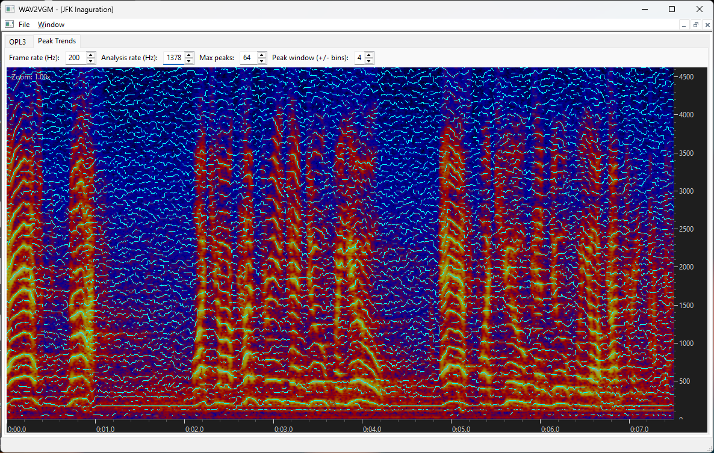

# WAV2VGM

A portable C++ GUI app that imports audio, normalizes it to mono 44.1 kHz,
and approximates it using real synth-chip register settings -- currently an
OPL3 (YMF262) FM synthesizer -- exportable as a standard VGM file playable
on real hardware or any VGM player.

## Images







## Stack

- CMake + Ninja
- wxWidgets 3.2+
- Cross-platform desktop UI using wxWidgets

## Features

- Main window with File menu: Import WAV, Exit
- Child project windows (MDI) with one tab per analysis mode -- "OPL3"
  (selected by default) and "Peak Trends" -- each holding its own
  scrollable/zoomable spectrogram view locked to that mode, plus that
  mode's own controls row directly above it. Selecting a tab selects the
  mode; there's no separate menu for it.
- Import a WAV file: downmix to mono, resample to 44.1 kHz (with an
  anti-aliasing/anti-imaging lowpass filter), amplitude-normalize, and
  build a real STFT spectrogram (parallelized across hardware threads --
  the default 32-sample hop means hundreds of thousands of FFT columns
  for a several-minute recording) mapped through a fixed 5-stop dBFS
  heatmap gradient (black/blue/red/yellow/white)
- **OPL3 mode**: fits up to 18 real OPL3 channels' worth of pure-sine
  oscillators against the recording (two side-by-side fitting workflows,
  picked via a radio box -- see `oplfit::FitChannelsInTurn` and
  `oplfit::FitChannelsPerFrame`), renders the result back through a
  vendored OPL3 emulator for playback/comparison, and exports a
  standard VGM file
- **Peak Trends mode**: tracks spectral peaks into persistent trend lines
  across the recording (additive sine-partial view of the signal) --
  currently more of a groundwork placeholder than a full workflow of its
  own
- Time-axis zoom/scroll stays in sync across tabs; each tab keeps its own
  independent vertical (Hz) range
- Settings (last-used import/export folders, spectrogram FFT/hop size)
  persist between runs in `WAV2VGM.ini` next to the executable

## Build on Linux

1. Install wxWidgets 3.2 development packages.
   - Ubuntu/Debian: `sudo apt install libwxgtk3.2-dev`
2. Configure and build:
   - `cmake -S . -B build`
   - `cmake --build build`

## Build on Windows

The toolchain is **MSVC + vcpkg** — it's what most Windows C++ developers
already have, needs nothing beyond a standard Visual Studio install, and
every piece of the build shares one runtime (no GCC/MSVC-runtime ABI
matching to worry about).

1. Install **Visual Studio 2022 or later** (Community edition is fine) with
   the **"Desktop development with C++"** workload. That workload bundles
   everything needed — the MSVC compiler, CMake, Ninja, and vcpkg — with
   no separate downloads.
2. Open **"Developer PowerShell for VS 2022"** (or 2026, etc. — a Start
   Menu shortcut the installer creates) and set `VCPKG_ROOT` to the
   vcpkg bundled with your VS install, e.g.:
   ```
   $env:VCPKG_ROOT = "C:\Program Files\Microsoft Visual Studio\<version>\Community\VC\vcpkg"
   ```
   (Set this once per shell session — or add it to your profile/environment
   permanently. If you'd rather manage vcpkg yourself, any vcpkg checkout
   with `bootstrap-vcpkg.bat` already run works the same way.)
3. From the repo root:
   - `cmake --preset windows`
   - `cmake --build --preset windows-debug`
4. Run `build/WAV2VGM.exe`.

The first configure builds wxWidgets and its dependencies from source via
vcpkg (a few minutes); after that they're cached and later configures are
fast. vcpkg also copies the required runtime DLLs next to the executable
automatically (`VCPKG_APPLOCAL_DEPS`), so `build/` stays portable — copy
it elsewhere and it still runs.

### Running the tests

- `dsp_selftest` validates the FFT/window/dBFS pipeline against a synthetic
  sine wave (checks peak-bin position, ~0 dBFS at full scale, and the
  5-stop color gradient). Run it directly (`build/dsp_selftest.exe`) or via
  `ctest` from the build directory.
- `opl3_selftest` validates the `OplChip` wrapper around the vendored OPL3
  emulator by writing a single-channel patch, rendering it, and checking
  the FFT's peak bin lands on the frequency the F-number/block registers
  were set for; checks the per-frame fitter (`FitAllFrames`/
  `RenderAllFrames`, a deterministic pure-sine fit with no search --
  additive-mode carrier, modulator fully silenced and disconnected,
  frequency/level read directly off the target spectrum) against a
  two-tone-in-sequence input, confirming the expected frame count, a
  non-silent render, and that consecutive frames within each sustained
  tone reuse an identical timbre; checks residual targeting (a second
  `FitAllFrames` call against a two-simultaneous-tone input, given the
  first channel's own render as `previousMixRendered`), confirming the
  two-channel mix is meaningfully louder than the first channel alone --
  i.e. the second channel is actually picking up the tone the first one
  didn't cover, not redundantly re-fitting the same one -- and, on a
  single-tone input, that a second channel fit against the first one's
  residual stays silent rather than re-approximating the only tone that
  exists; checks the "Make OPL3" button's combined multi-channel workflow
  (`FitChannelsInTurn`), confirming it stops within the requested channel
  count and that its incrementally-summed mix (each new channel's own
  solo render added into a running total) matches `RenderAllFramesMix`'s
  real joint simulation of the same channels almost exactly, verifying
  against the real emulator that the additive-superposition assumption
  behind that optimization actually holds; checks VGM export
  (`vgm::WriteVgmFile`) by writing a two-channel fit out and reading the
  raw bytes back, confirming the header fields a real player/hardware
  would rely on (magic, EOF offset, a resolvable data offset, a nonzero
  YMF262 clock) and that the data block contains register writes and ends
  with the proper terminator; does the same end-to-end check for the
  earlier whole-recording single-channel fitter (`FitSingleChannel`,
  which still does search FM modulator settings and operator waveforms,
  kept working but not currently wired into the UI); and checks the
  earlier whole-recording multi-channel path (`FitMultiChannel`/
  `RenderMix`, also kept working but not currently wired into the UI)
  against a two-tone input, confirming it splits the tones across at
  least two channels and that the combined mix is non-silent.

## Third-party components / licensing

This project vendors [`dbopl`](https://github.com/rofl0r/dbopl)
(`src/third_party/dbopl/`), the OPL3 (YMF262) emulator core extracted
from [DOSBox](https://www.dosbox.com/), copyright (C) 2002-2020 The
DOSBox Team, used unmodified to power the "OPL3" analysis mode. It is
licensed under **GPL2+** (full text in `LICENSE-GPL2.txt`). Because it's
statically linked into the executable, **any distributed build with the
OPL3 analysis mode compiled in is a combined work under GPL2+ as a
whole** — see `NOTICE.md` for details.

## Notes / known limitations

- MP3 import is not implemented (out of scope for this pass); the Import
  dialog only accepts `.wav`.
- There's no project save/load -- each imported WAV opens a fresh child
  window and its analysis is derived automatically from it, with nothing
  interactive enough to be worth persisting between sessions yet.
- The spectrogram defaults to 4096 samples per column (92ms) with a
  32-sample (0.072ms) hop between columns. Both are user-editable via
  `WAV2VGM.ini` (`FftSize`/`HopSize`, next to the executable, created on
  first run) rather than requiring a rebuild -- there's no in-app
  Preferences screen for them yet. `FftSize` must be a power of two;
  invalid values in the INI are ignored in favor of the default.